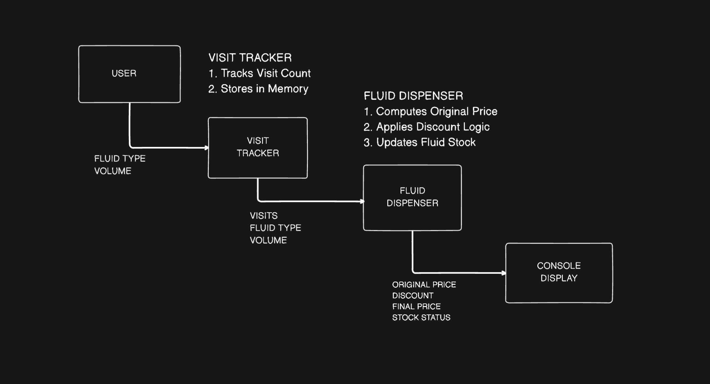

# 🪙 COIN BASED MULTI FLUID DISPENSER

This project is a Verilog-based digital logic design for a "Coin-Based Multi-Fluid Dispenser." It simulates a machine that dispenses three types of fluids, calculates costs, and applies loyalty discounts based on user visit history.

---

## 👥 Team Details

* **Semester:** 3rd Sem B. Tech. CSE
* **Section:** S2
* **Team ID:** T17
* **Member-1:** B.Charan 241CS215 `charan.241cs215@nitk.edu.in`
* **Member-2:** B.Rohith 241CS219 `rohithbontha.241cs219@nitk.edu.in`
* **Member-3:** Prem Sai 241CS233 `premsai.241cs233@nitk.edu.in`

---

## 🔬 Abstract

**Background:** Beverage dispensing in public spaces such as stations, schools, and workplaces must be both economical and user-friendly. Traditional dispensers are limited to one fluid and require supervision, often leading to wastage or misuse.

**Motivation:** The goal is to design a digital logic-based dispenser that accepts coins, offers multiple fluids, and dispenses quantities according to price–volume proportions. Using sequential and combinational logic, the system can operate autonomously with low cost and high reliability.

**System Features:**
* Supports three fluids: *Water, Utility Chemical, Soft Drink*
* Each fluid follows its own price–volume ratio
* Loyalty discounts based on visit count (up to 50% for water, 20% for chemical, 30% for soft drink)
* Safety features include overflow prevention, refill alerts, and manual refill options

The design demonstrates the integration of **finite state machines** and **digital logic** in a real-world application combining multi-fluid dispensing, dynamic pricing, and customer incentives.

---

## 📊 Functional Block Diagram

*(This is a placeholder. Replace the URL with your actual block diagram image.)*

---

## ⚙️ Working

### Project Overview
This Verilog-based system allows users to select a fluid, input volume, and pay using coins. It computes price dynamically, applies loyalty discounts, and updates remaining stock.

### Modules
1.  **visit_tracker:** Tracks each user's number of visits.
2.  **fluid_dispenser:** Calculates price, discount, and remaining stock.
3.  **display_console:** Outputs results in a formatted terminal table.
4.  **testbench:** Integrates and simulates all modules.

### Functional Table

| Step | Inputs | Module | Function Performed | Outputs |
| :--- | :--- | :--- | :--- | :--- |
| 1 | `clk`, `reset` | `visit_tracker` | Initialize or reset counters | `visits = 0` |
| 2 | `user_id` | `visit_tracker` | Increment user's visit count | `visits` (updated) |
| 3 | `fluid_type`, `volume`, `visits` | `fluid_dispenser` | Compute base price | `original_price` |
| 4 | `visits` | `fluid_dispenser` | Determine loyalty discount | `discount_percent` |
| 5 | `price`, `discount` | `fluid_dispenser` | Apply discount | `final_price` |
| 6 | `volume` | `fluid_dispenser` | Update remaining stock | `remaining_qty` |
| 7 | `stock` | `fluid_dispenser` | Generate status message | `message` |
| 8 | All outputs | `display_console` | Display formatted table | Console Output |

### Flowchart
`START` → `Input user_id, fluid_type, volume` → `VISIT TRACKER` → `Update visit count` → `FLUID DISPENSER` → `Compute price, discount, stock` → `DISPLAY CONSOLE` → `Show output table` → `END`

### System Data Flow
* `[clk, reset, user_id]` → `visit_tracker` → `visits`
* `[fluid_type, volume_l, visits]` → `fluid_dispenser` → `display_console`

### Output Parameters
`original_price`, `final_price`, `discount_percent`, `remaining_qty`, `message`

---

## 💡 Logisim Circuit Diagram

*(Placeholder for your Logisim circuit diagram image.)*

---

## 💻 Verilog Code

This project is modeled at three levels of abstraction. The files are located in the `Verilog/` directory:

* **Behavioral Modeling:**
    * [Module (`behaviro.v`)](Verilog/behaviro.v)
    * [Testbench (`behaviro-tb.v`)](Verilog/behaviro-tb.v)

* **Dataflow Modeling:**
    * [Module (`dataflow.v`)](Verilog/dataflow.v)
    * [Testbench (`dataflow-tb.v`)](Verilog/dataflow-tb.v)

* **Gate-Level Modeling:**
    * [Module (`gate.v`)](Verilog/gate.v)
    * [Testbench (`gate-tb.v`)](Verilog/gate-tb.v)

 

---

## References

1. M. Morris Mano, Digital Design, Pearson, 5th Edition, 2013.
2. R. J. Tocci, N. S. Widmer, Digital Systems: Principles and Applications, Pearson, 10th Edition
3. A. Kumar, Fundamentals of Digital Circuits, PHI Learning, 4th Edition, 2016.
4. IEEE Xplore Digital Library, https://ieeexplore.ieee.org
5. ResearchGate, Coin-operated dispensing system articles, https://www.researchgate.net
